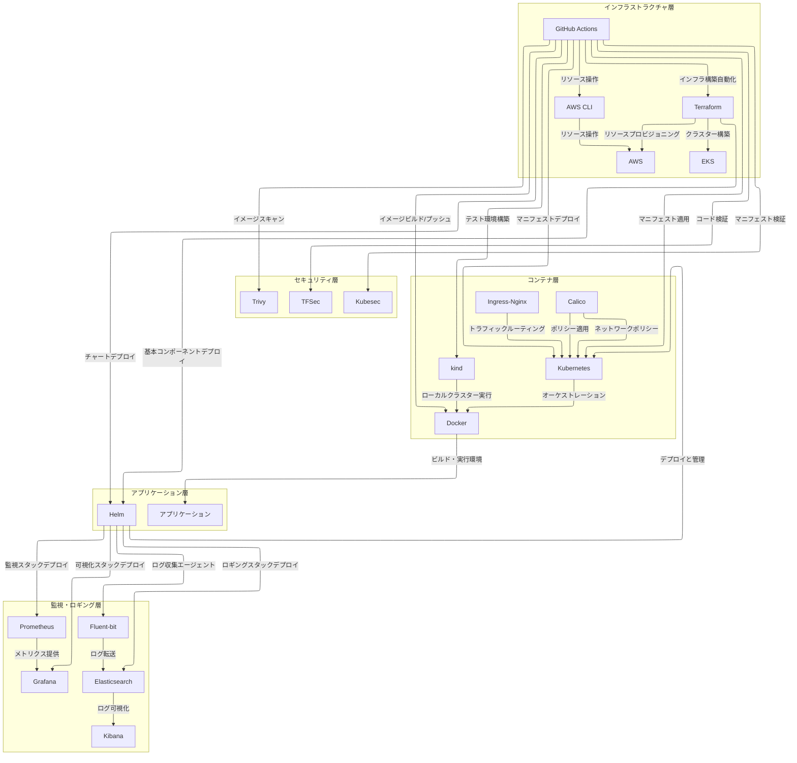

## SRE Kubernetes IaC プロジェクト

## 目次

<!-- START doctoc generated TOC please keep comment here to allow auto update -->
<!-- DON'T EDIT THIS SECTION, INSTEAD RE-RUN doctoc TO UPDATE -->

- [概要](#%E6%A6%82%E8%A6%81)
- [主な機能](#%E4%B8%BB%E3%81%AA%E6%A9%9F%E8%83%BD)
- [ディレクトリ構造](#%E3%83%87%E3%82%A3%E3%83%AC%E3%82%AF%E3%83%88%E3%83%AA%E6%A7%8B%E9%80%A0)
- [主要ツールの説明と必要条件](#%E4%B8%BB%E8%A6%81%E3%83%84%E3%83%BC%E3%83%AB%E3%81%AE%E8%AA%AC%E6%98%8E%E3%81%A8%E5%BF%85%E8%A6%81%E6%9D%A1%E4%BB%B6)
  - [ツールの概要](#%E3%83%84%E3%83%BC%E3%83%AB%E3%81%AE%E6%A6%82%E8%A6%81)
  - [ツール間の関係性](#%E3%83%84%E3%83%BC%E3%83%AB%E9%96%93%E3%81%AE%E9%96%A2%E4%BF%82%E6%80%A7)
  - [ツール間の関係性の図解](#%E3%83%84%E3%83%BC%E3%83%AB%E9%96%93%E3%81%AE%E9%96%A2%E4%BF%82%E6%80%A7%E3%81%AE%E5%9B%B3%E8%A7%A3)
  - [必要バージョン](#%E5%BF%85%E8%A6%81%E3%83%90%E3%83%BC%E3%82%B8%E3%83%A7%E3%83%B3)
- [セットアップ手順](#%E3%82%BB%E3%83%83%E3%83%88%E3%82%A2%E3%83%83%E3%83%97%E6%89%8B%E9%A0%86)
  - [1. リポジトリのクローン](#1-%E3%83%AA%E3%83%9D%E3%82%B8%E3%83%88%E3%83%AA%E3%81%AE%E3%82%AF%E3%83%AD%E3%83%BC%E3%83%B3)
  - [2. ローカル開発環境のセットアップ](#2-%E3%83%AD%E3%83%BC%E3%82%AB%E3%83%AB%E9%96%8B%E7%99%BA%E7%92%B0%E5%A2%83%E3%81%AE%E3%82%BB%E3%83%83%E3%83%88%E3%82%A2%E3%83%83%E3%83%97)
    - [前提条件](#%E5%89%8D%E6%8F%90%E6%9D%A1%E4%BB%B6)
    - [自動セットアップ（推奨）](#%E8%87%AA%E5%8B%95%E3%82%BB%E3%83%83%E3%83%88%E3%82%A2%E3%83%83%E3%83%97%E6%8E%A8%E5%A5%A8)
    - [クリーンアップ](#%E3%82%AF%E3%83%AA%E3%83%BC%E3%83%B3%E3%82%A2%E3%83%83%E3%83%97)
    - [手動セットアップ](#%E6%89%8B%E5%8B%95%E3%82%BB%E3%83%83%E3%83%88%E3%82%A2%E3%83%83%E3%83%97)
  - [3. AWS環境のセットアップ](#3-aws%E7%92%B0%E5%A2%83%E3%81%AE%E3%82%BB%E3%83%83%E3%83%88%E3%82%A2%E3%83%83%E3%83%97)
    - [AWS認証情報の設定](#aws%E8%AA%8D%E8%A8%BC%E6%83%85%E5%A0%B1%E3%81%AE%E8%A8%AD%E5%AE%9A)
    - [Terraform初期化とAWSリソースのプロビジョニング](#terraform%E5%88%9D%E6%9C%9F%E5%8C%96%E3%81%A8aws%E3%83%AA%E3%82%BD%E3%83%BC%E3%82%B9%E3%81%AE%E3%83%97%E3%83%AD%E3%83%93%E3%82%B8%E3%83%A7%E3%83%8B%E3%83%B3%E3%82%B0)
    - [EKSクラスタ認証情報の設定](#eks%E3%82%AF%E3%83%A9%E3%82%B9%E3%82%BF%E8%AA%8D%E8%A8%BC%E6%83%85%E5%A0%B1%E3%81%AE%E8%A8%AD%E5%AE%9A)
- [アクセス情報](#%E3%82%A2%E3%82%AF%E3%82%BB%E3%82%B9%E6%83%85%E5%A0%B1)
- [監視機能](#%E7%9B%A3%E8%A6%96%E6%A9%9F%E8%83%BD)
  - [メトリクス](#%E3%83%A1%E3%83%88%E3%83%AA%E3%82%AF%E3%82%B9)
  - [アラート](#%E3%82%A2%E3%83%A9%E3%83%BC%E3%83%88)
- [セキュリティ機能](#%E3%82%BB%E3%82%AD%E3%83%A5%E3%83%AA%E3%83%86%E3%82%A3%E6%A9%9F%E8%83%BD)
  - [ネットワークポリシー](#%E3%83%8D%E3%83%83%E3%83%88%E3%83%AF%E3%83%BC%E3%82%AF%E3%83%9D%E3%83%AA%E3%82%B7%E3%83%BC)
  - [セキュリティ設定](#%E3%82%BB%E3%82%AD%E3%83%A5%E3%83%AA%E3%83%86%E3%82%A3%E8%A8%AD%E5%AE%9A)
- [セキュリティ注意事項](#%E3%82%BB%E3%82%AD%E3%83%A5%E3%83%AA%E3%83%86%E3%82%A3%E6%B3%A8%E6%84%8F%E4%BA%8B%E9%A0%85)
- [CI/CD パイプライン](#cicd-%E3%83%91%E3%82%A4%E3%83%97%E3%83%A9%E3%82%A4%E3%83%B3)
- [トラブルシューティング](#%E3%83%88%E3%83%A9%E3%83%96%E3%83%AB%E3%82%B7%E3%83%A5%E3%83%BC%E3%83%86%E3%82%A3%E3%83%B3%E3%82%B0)
- [ディザスタリカバリ手順](#%E3%83%87%E3%82%A3%E3%82%B6%E3%82%B9%E3%82%BF%E3%83%AA%E3%82%AB%E3%83%90%E3%83%AA%E6%89%8B%E9%A0%86)
  - [バックアップ](#%E3%83%90%E3%83%83%E3%82%AF%E3%82%A2%E3%83%83%E3%83%97)
  - [リストア手順](#%E3%83%AA%E3%82%B9%E3%83%88%E3%82%A2%E6%89%8B%E9%A0%86)
- [詳細なトラブルシューティングガイド](#%E8%A9%B3%E7%B4%B0%E3%81%AA%E3%83%88%E3%83%A9%E3%83%96%E3%83%AB%E3%82%B7%E3%83%A5%E3%83%BC%E3%83%86%E3%82%A3%E3%83%B3%E3%82%B0%E3%82%AC%E3%82%A4%E3%83%89)
  - [一般的な問題](#%E4%B8%80%E8%88%AC%E7%9A%84%E3%81%AA%E5%95%8F%E9%A1%8C)
  - [環境別の注意点](#%E7%92%B0%E5%A2%83%E5%88%A5%E3%81%AE%E6%B3%A8%E6%84%8F%E7%82%B9)
- [ライセンス](#%E3%83%A9%E3%82%A4%E3%82%BB%E3%83%B3%E3%82%B9)

<!-- END doctoc generated TOC please keep comment here to allow auto update -->

## 概要
マイクロサービス基盤のSRE運用管理用リポジトリです。AWS、Kubernetes、Terraform、Ansibleを使用したインフラストラクチャの管理を行います。本プロジェクトは、開発環境から本番環境まで一貫した管理を提供し、監視、ロギング、セキュリティを統合したマイクロサービス基盤を実現します。

## 主な機能
- Kubernetesクラスターの自動構築（AWS EKS / kind）
- マイクロサービスのデプロイと管理
- 監視（Prometheus + Grafana）
- ネットワークポリシーによるセキュリティ制御
- CI/CD パイプライン（GitHub Actions）
- Infrastructure as Code（Terraform）
- 構成管理（Ansible）

## ディレクトリ構造
```
.
├── terraform/          # AWSインフラストラクチャのIaCコード
│   ├── environments/   # 環境別（dev, stg, prod）の設定
│   ├── modules/       # 再利用可能なTerraformモジュール
│   └── scripts/       # Terraform実行用スクリプト
├── kubernetes/         # Kubernetes関連の設定
│   ├── helm/          # Helmチャート
│   │   ├── monitoring/  # Prometheus/Grafana設定
│   │   └── logging/    # ロギングスタック設定
│   ├── manifests/     # Kubernetesマニフェスト
│   │   └── sample-app/ # サンプルアプリケーション
│   ├── kind/          # ローカル開発環境設定
│   └── scripts/       # クラスタ管理スクリプト
├── ansible/           # サーバー構成管理
│   ├── inventories/   # 環境別インベントリ
│   ├── playbooks/     # Ansibleプレイブック
│   └── roles/         # Ansible roles
├── monitoring/        # 監視設定
│   ├── prometheus/    # Prometheus設定
│   ├── grafana/      # Grafanaダッシュボード
│   └── alertmanager/ # アラート設定
├── scripts/           # ユーティリティスクリプト
├── docs/             # プロジェクトドキュメント
└── .github/          # GitHub Actions CI/CD設定
```

## 主要ツールの説明と必要条件

### ツールの概要
- **AWS CLI**: AWSクラウドサービスをコマンドラインから操作するための統合インターフェース
- **Terraform**: インフラストラクチャをコードとして管理し、クラウドリソースを宣言的に構築・管理するためのIaCツール
- **Kubernetes**: コンテナオーケストレーションプラットフォームで、アプリケーションのデプロイ・スケーリング・管理を自動化
- **Helm**: Kubernetesのパッケージマネージャーで、アプリケーションやサービスの定義・インストール・アップグレードを簡素化
- **Ansible**: サーバー構成管理とアプリケーションデプロイを自動化するための、エージェントレスな構成管理ツール
- **Go**: 高性能で並行処理に優れた、クラウドネイティブアプリケーション開発に適したプログラミング言語
- **Docker**: アプリケーションとその依存関係をコンテナとしてパッケージ化し、一貫した環境で実行するためのプラットフォーム
- **kind**: ローカル環境でKubernetesクラスターを素早く作成・テストするための開発用ツール
- **Calico**: Kubernetesのネットワークポリシーを実装するCNIプラグイン
- **Prometheus**: メトリクス収集と保存のためのモニタリングシステム
- **Grafana**: メトリクスの可視化とダッシュボード作成のためのプラットフォーム
- **Elasticsearch**: ログデータの保存と検索のための分散検索エンジン
- **Fluent-bit**: 軽量なログ収集エージェント
- **Kibana**: Elasticsearchのデータを可視化・分析するためのダッシュボード
- **Ingress-Nginx**: KubernetesのIngress APIを実装するNginxベースのコントローラー
- **Trivy**: コンテナイメージとファイルシステムの脆弱性スキャナー
- **TFSec**: Terraformコードのセキュリティスキャン
- **GitHub Actions**: CI/CDワークフローの自動化プラットフォーム

### ツール間の関係性

凡例:
- A → B : AがBに対して操作/利用する関係（例：デプロイ、監視、実行、管理）

1. **インフラストラクチャ層**
   - GitHub Actions → Terraform: インフラ構築の自動化
   - Terraform → AWS: クラウドリソースのプロビジョニング
   - Terraform → EKS: Kubernetesクラスターの構築
   - Terraform → Helm: 基本コンポーネントのデプロイ
   - AWS CLI → AWS: クラウドリソースの操作

2. **コンテナ層**
   - kind → Docker: ローカルKubernetesクラスターの実行
   - Kubernetes → Docker: コンテナのオーケストレーション
   - Ingress-Nginx → Kubernetes: トラフィックルーティング
   - Calico → Kubernetes: ネットワークポリシーの実装

3. **アプリケーション層**
   - Docker → アプリケーション: ビルド・実行環境の提供
   - Helm → Kubernetes: アプリケーションのデプロイと管理
   - GitHub Actions → Docker: イメージのビルドとプッシュ
   - GitHub Actions → Kubernetes: マニフェストのデプロイ

4. **監視・ロギング層**
   - Helm → Prometheus: 監視スタックのデプロイ
   - Helm → Grafana: 可視化スタックのデプロイ
   - Prometheus → Grafana: メトリクスデータの提供
   - Helm → Elasticsearch: ロギングスタックのデプロイ
   - Helm → Fluent-bit: ログ収集エージェントのデプロイ
   - Fluent-bit → Elasticsearch: ログの転送
   - Elasticsearch → Kibana: ログデータの可視化

5. **セキュリティ層**
   - GitHub Actions → Trivy: コンテナイメージのスキャン
   - GitHub Actions → TFSec: Terraformコードの検証
   - GitHub Actions → Kubesec: Kubernetesマニフェストの検証
   - Calico → Kubernetes: ネットワークポリシーの適用

6. **CI/CD層**
   - GitHub Actions → AWS CLI: クラウドリソースの操作
   - GitHub Actions → Helm: チャートのデプロイ
   - GitHub Actions → kind: テスト環境の構築
   - GitHub Actions → kubectl: マニフェストの適用

### ツール間の関係性の図解



### 必要バージョン
- AWS CLI >= 2.0
- Terraform >= 1.0.0
- Kubernetes >= 1.20
- Helm >= 3.0.0
- Ansible >= 2.9
- Go >= 1.19
- Docker >= 20.10
- kind >= 0.20.0

## セットアップ手順

### 1. リポジトリのクローン
```bash
git clone [repository-url]
cd [repository-name]
```

### 2. ローカル開発環境のセットアップ

#### 前提条件
以下のツールが必要です：
- Docker >= 20.10
- kubectl >= 1.20
- Helm >= 3.0.0
- Terraform >= 1.0.0
- kind >= 0.20.0

#### 自動セットアップ（推奨）
提供されているセットアップスクリプトを使用して環境を構築できます：

```bash
# スクリプトに実行権限を付与
chmod +x scripts/setup.sh

# セットアップの実行
./scripts/setup.sh
```

このスクリプトは以下の処理を自動的に行います：
- 必要なツールのバージョン確認
- kindクラスターの作成
- 監視スタック（Prometheus + Grafana）のデプロイ
- サンプルアプリケーションのデプロイ
- （オプション）負荷テストの実行

#### クリーンアップ
環境を完全にクリーンアップするには、以下のコマンドを実行します：

```bash
# スクリプトに実行権限を付与
chmod +x scripts/cleanup.sh

# クリーンアップの実行
./scripts/cleanup.sh
```

このスクリプトは以下の処理を行います：
- 実行中の負荷テストプロセスの終了
- kindクラスターの削除
- 未使用のDockerコンテナとイメージの削除

#### 手動セットアップ

1. **kindクラスターの作成**
   ```bash
   # kindクラスターのセットアップ（Calicoを使用）
   kind create cluster --config kubernetes/kind/config-with-calico.yaml

   # Calicoのインストール
   kubectl create -f https://raw.githubusercontent.com/projectcalico/calico/v3.26.1/manifests/tigera-operator.yaml
   kubectl create -f kubernetes/calico/custom-resources.yaml

   # クラスターの準備ができるまで待機
   kubectl wait --for=condition=Ready nodes --all --timeout=300s
   ```

2. **監視スタックのセットアップ**
   ```bash
   # Helm repositoryの追加
   helm repo add prometheus-community https://prometheus-community.github.io/helm-charts
   helm repo add grafana https://grafana.github.io/helm-charts
   helm repo update

   # Prometheusのインストール
   helm upgrade --install prometheus prometheus-community/prometheus \
     --namespace monitoring \
     --values kubernetes/helm/monitoring/prometheus-values.yaml

   # Grafanaのインストール
   helm upgrade --install grafana grafana/grafana \
     --namespace monitoring \
     --values kubernetes/helm/monitoring/grafana-values.yaml
   ```

3. **サンプルアプリケーションのデプロイ**
   ```bash
   # アプリケーションのビルドとデプロイ
   cd kubernetes/sample-app
   docker build -t sample-app:latest .
   kind load docker-image sample-app:latest
   kubectl apply -f ../manifests/sample-app/
   ```

4. **動作確認**
   ```bash
   # Podの状態確認
   kubectl get pods -n microservices
   kubectl get pods -n monitoring

   # 各エンドポイントへのアクセス確認
   curl http://localhost:30002  # サンプルアプリケーション
   curl http://localhost:30000  # Prometheus
   curl http://localhost:30001  # Grafana
   ```

### 3. AWS環境のセットアップ

#### AWS認証情報の設定
```bash
aws configure
# リージョン、アクセスキー、シークレットキーを入力
```

#### Terraform初期化とAWSリソースのプロビジョニング
```bash
cd terraform/environments/dev
terraform init
terraform plan  # 変更内容の確認
terraform apply # インフラストラクチャのプロビジョニング
```

#### EKSクラスタ認証情報の設定
```bash
aws eks update-kubeconfig --name [cluster-name] --region [region]
```

## アクセス情報
- Prometheus: http://localhost:30000
  - メトリクス収集間隔: 15秒
  - データ保持期間: 15日
- Grafana: http://localhost:30001
  - ユーザー名: admin
  - パスワード: strongpassword（開発環境のみ）
  - デフォルトダッシュボード:
    - Kubernetes Cluster Overview
    - Node Exporter
    - Application Metrics
- サンプルアプリケーション: http://localhost:30002
  - エンドポイント:
    - / : Hello World
    - /metrics : Prometheusメトリクス

## 監視機能
### メトリクス
- ノードレベルメトリクス（CPU、メモリ、ディスク、ネットワーク）
- Kubernetesリソースメトリクス（Pod、Deployment、Service）
- アプリケーションメトリクス（レイテンシー、エラーレート、リクエスト数）

### アラート
- ノード状態（NotReady、高負荷）
- Pod状態（CrashLoopBackOff、Pending）
- アプリケーション状態（高レイテンシー、高エラーレート）
- リソース使用率（CPU、メモリ、ディスク）

## セキュリティ機能
### ネットワークポリシー
- Pod間通信の制御
- 名前空間間の通信制御
- 外部通信の制限

### セキュリティ設定
- Pod Security Context
- RBAC認証
- Network Policy
- Secrets管理

## セキュリティ注意事項
1. 本番環境では必ずシークレットを適切に管理する
   - AWS Secrets Managerの使用
   - Kubernetes Secretsの暗号化
2. AWS認証情報は環境変数または AWS Secrets Manager で管理する
3. Grafanaなどのツールは本番環境で適切なパスワードを設定する
4. NetworkPolicyを使用してPod間通信を制限する
5. 定期的なセキュリティスキャンを実施する
   - Trivy（コンテナスキャン）
   - GitGuardian（シークレットスキャン）

## CI/CD パイプライン
- テスト自動化
- コード品質チェック
- セキュリティスキャン
- 自動デプロイ（開発環境）
- 承認フロー（本番環境）

## トラブルシューティング
一般的な問題の解決方法は `docs/operations/troubleshooting-guide.md` を参照してください。

## ディザスタリカバリ手順

### バックアップ
1. **EKSクラスター**
   - etcdのスナップショット
   - Persistent Volumeのバックアップ
2. **設定データ**
   - Kubernetes Secret/ConfigMap
   - Terraformの状態ファイル
3. **監視データ**
   - Prometheusのメトリクス
   - Grafanaのダッシュボード

### リストア手順
1. **インフラストラクチャの復旧**
   ```bash
   terraform init
   terraform apply
   ```
2. **アプリケーションの復旧**
   ```bash
   kubectl apply -f kubernetes/manifests/
   helm upgrade --install monitoring kubernetes/helm/monitoring
   ```

## 詳細なトラブルシューティングガイド

### 一般的な問題
1. **Podが起動しない**
   ```bash
   kubectl describe pod <pod-name>
   kubectl logs <pod-name>
   ```

2. **メトリクスが収集されない**
   - Prometheusのターゲット確認
   - サービスモニター設定の確認

3. **ネットワーク接続の問題**
   ```bash
   kubectl exec -it <pod-name> -- ping <target>
   kubectl exec -it <pod-name> -- nslookup <service>
   ```

### 環境別の注意点
- **開発環境**
  - kind特有の問題と解決方法
  - ローカルリソースの制限

- **ステージング/本番環境**
  - EKS特有の問題と解決方法
  - クラウドリソースの制限

## ライセンス
このプロジェクトは[MIT License](LICENSE)の下で公開されています。

詳細は[LICENSE](LICENSE)ファイルを参照してください。 